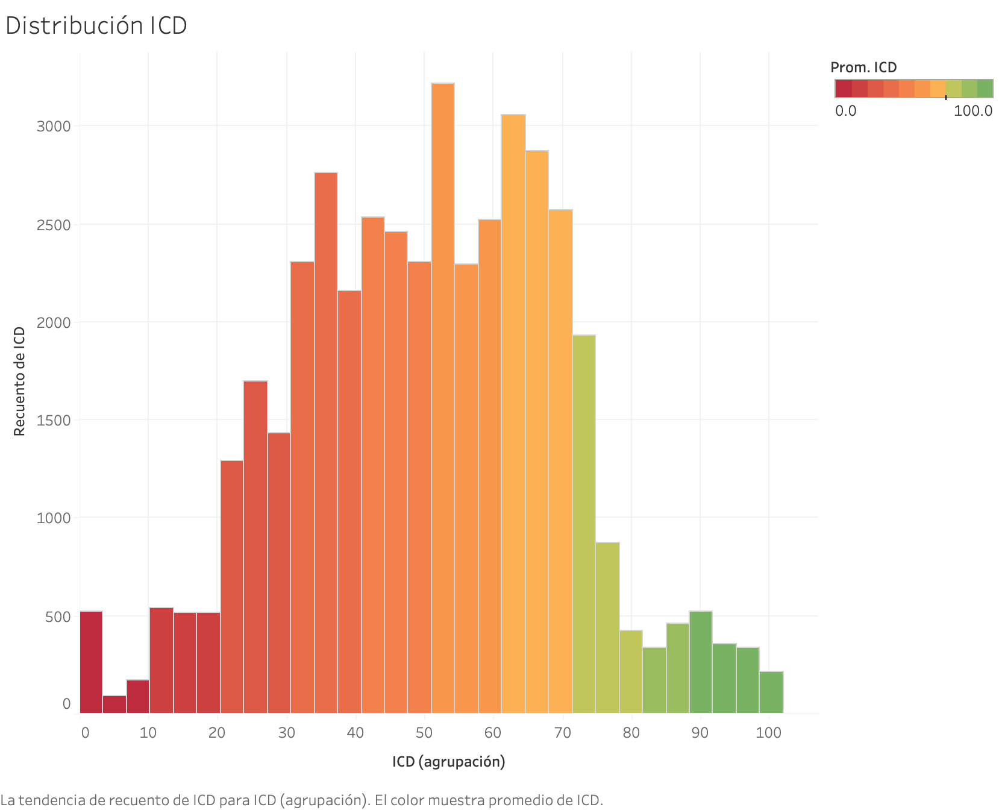

# Algoritmo de Calidad - Perú

## ¿Qué es?

El **Algoritmo de validación de Calidad** es un modelo diseñado para unificar y automatizar los procesos de limpieza, transformación, unificación y validación de datos en la mayor medida posible. Su objetivo principal es asegurar que la información sea confiable y representativa de la realidad, facilitando la toma de decisiones basadas en datos precisos y fidedignos.

Este algoritmo forma parte del proyecto **AUTO AUDITORÍA 2023**, el cual propuso el uso de tecnología de reconocimiento fotográfico para habilitar a la fuerza de ventas como auditores. De esta manera, se busca recopilar información de manera eficiente, rápida y orientada a datos para tomar decisiones informadas. El programa, iniciado en 2023, se centró inicialmente en el canal tradicional, incluyendo subcanales como abarrotes y fruterías, que son esenciales para los negocios que consumen nuestros productos a nivel nacional.


La idea de utilizar la fuerza de mercado como auditores, aprovechando la logística existente y la presencia diaria de personal en el mercado, marca un avance significativo hacia una empresa más orientada a la tecnología y a la toma de decisiones basadas en datos reales.

La implementación de este algoritmo surge de la necesidad de establecer una barrera de entrada que permita diferenciar entre los datos recopilados que realmente representan la realidad de aquellos registros que son inexactos o insuficientes para fundamentar una decisión bien informada.

## ¿Para qué sirve?

El **Algoritmo de Calidad** se ha diseñado para realizar una serie de tareas críticas dentro de un flujo automatizado, minimizando el error humano tanto como sea posible. Aunque cada carpeta contiene un manual detallado con la información necesaria, este README ofrece una visión general sobre la funcionalidad del algoritmo, su propósito, importancia y los pasos clave que sigue.

En la práctica, este algoritmo integra diversas fuentes de información, como archivos `parquet` de iRed, bases de datos de clientes y usuarios de Blob Storage, y datos de plataformas como VisionPortal para realizar una doble validación y un filtrado adecuado.

Actualmente, el proceso de extracción de datos es manual, pero se busca su automatización a través de dos posibles vías:

1. **Creación de una API** específica para el algoritmo, que actúe como un filtro por el cual los datos entran y son procesados de manera simplificada.
2. **Conexión directa a servidor**, que permitiría una interacción más manual al conectar el algoritmo directamente con la fuente de datos de iRed, o bien, con el data lake gestionado por el departamento de analítica avanzada.

Posteriormente, el algoritmo almacena la información procesada en la carpeta de fuentes de datos. Esta carpeta contiene repositorios variados que refieren a distintos tipos de archivos `parquet`, los cuales incluyen información valiosa obtenida de las encuestas, como duración, desglose de productos, anaqueles y enfriadores detectados, entre otros. Dada la voluminosa cantidad de información, se implementa un proceso de limpieza y transformación de datos para facilitar su manejo por parte de los usuarios finales, tales como gerencias u operaciones, quienes utilizan estos datos para la toma de decisiones.

El algoritmo también emplea un sistema de imputación basado en vecinos cercanos para identificar patrones entre clientes y hacer inferencias. Esto permite la creación de parámetros que, sin generalizar a toda la población, usan un método de clusterización estratificada para segmentar a los clientes por características compartidas, siendo el tamaño del cliente y el subcanal las variables más influyentes en este proceso.


Con los grupos identificados, se establecen parámetros basados en variables medibles a través de los archivos `parquet`, tales como cantidad de frentes, presencia de competencia, duración de la encuesta y coordenadas. La ponderación de estas variables nos permite discernir qué encuestas reflejan fielmente la realidad.

El resultado de este proceso es un dataframe que ofrece una visión completa sobre el desempeño de cada indicador, permitiéndonos filtrar la información para tomar decisiones basadas en datos confiables.

## ¿Por qué es clave el Algoritmo de Calidad?

El **Algoritmo de Calidad** se ha convertido en un componente esencial por varias razones:

- **Adaptación al crecimiento de datos:** En un mundo donde el volumen de datos crece exponencialmente, es crucial asegurar que la calidad de los datos entrantes se mantenga a un nivel alto. Este algoritmo permite filtrar y validar la información para garantizar su relevancia y precisión.

- **Detección de patrones y comprensión de usuarios:** A través del análisis de datos de calidad, podemos empezar a identificar patrones de comportamiento, entender mejor a los usuarios, y evaluar la eficacia de las estrategias implementadas. Esto también ofrece insights sobre el nivel de compromiso de los usuarios y la efectividad de sus acciones.

- **Optimización de la toma de decisiones:** Con datos de alta calidad, las decisiones basadas en la información recopilada son más precisas y fiables. Esto es crucial para el desarrollo estratégico y la planificación a largo plazo.

- **Mejora continua:** El algoritmo permite una revisión constante de los procesos y estrategias de recopilación de datos, asegurando una mejora continua en la calidad de los datos recogidos.



## ¿Quién se beneficia del Algoritmo de Calidad?

Este repositorio ha sido diseñado principalmente para el **Departamento de Analítica de Arca Continental**, ofreciendo una herramienta vital para su trabajo diario. Se ha tomado especial cuidado en asegurar que toda la información sensible haya sido retirada para mantener la privacidad y confidencialidad de los datos.

Sin embargo, su alcance va más allá de la organización:

- **Usuarios de la plataforma digital:** Cualquier usuario que desee explorar o utilizar este repositorio para fines propios, o como referencia para la creación de sus propios validadores de calidad, encontrará en este código una fuente de inspiración valiosa.

- **Comunidad de desarrolladores y analistas de datos:** Al ser accesible para aquellos interesados en las prácticas de validación de datos, fomenta una cultura de colaboración y mejora continua en el ámbito de la analítica de datos.

En resumen, aunque el algoritmo esté diseñado con un propósito específico dentro de Arca Continental, su estructura y metodología ofrecen un valor considerable para cualquier persona o entidad interesada en la validación y mejora de la calidad de los datos.

## Información Extraoficial para Uso y Aportación

### Instalación

Para ejecutar el Algoritmo de Calidad, necesitarás R y varias bibliotecas específicas. A continuación, se detallan los pasos para preparar tu entorno.

### Requisitos Previos

Antes de iniciar, asegúrate de tener R instalado en tu sistema. Puedes descargarlo desde [CRAN](https://cran.r-project.org/).

### Llamar Librerías

Una vez instalado R, necesitarás instalar y cargar varias librerías para el correcto funcionamiento del algoritmo. Puedes hacerlo ejecutando los siguientes comandos en tu consola de R:

```R
install.packages("dplyr")
install.packages("readr")
install.packages("readxl")
install.packages("tidyverse")
install.packages("fs")
install.packages("purrr")
install.packages("openxlsx")
install.packages("sf")
install.packages("httr")
install.packages("jsonlite")
install.packages("ggplot2")
```

### Uso

Para utilizar el algoritmo, asegúrate de seguir los pasos detallados en las secciones anteriores para configurar tu entorno e instalar las librerías necesarias. Se proveen ejemplos específicos de cómo leer tus datos, aplicar el algoritmo de procesamiento, y visualizar o exportar los resultados en las secciones de documentación pertinentes.

### Contribuir

¡Tu contribución es bienvenida! Para contribuir al proyecto:

- Realiza un fork del repositorio.
- Haz tus cambios y mejoras en tu copia del proyecto.
- Envía un Pull Request para que tus cambios sean revisados y, si son adecuados, incorporados al proyecto principal.
- Asegúrate de seguir las normas de codificación establecidas y documentar adecuadamente tus contribuciones.
- Para reportar bugs o sugerir mejoras, utiliza el sistema de issues del repositorio.

### Licencia

Este proyecto se distribuye bajo una licencia exclusiva, diseñada para restringir el uso, distribución, y modificación a miembros autorizados de la organización Arca Continental y para propósitos específicamente definidos por la misma. Para detalles completos, por favor consulta el texto de la licencia incluido en el repositorio.

### Contacto

Para consultas, soporte o más información sobre cómo puedes involucrarte con el Algoritmo de Calidad, no dudes en contactarnos a través de:

- **Correo Electrónico:** david.dominguezm@ext.arcacontal.com / daviddomor180@hotmail.com
- **Sistema de Tickets:** Para soporte técnico o reporte de problemas, utiliza nuestro sistema de tickets disponible.
- **Instagram:** daviddrums180.sql

Esperamos que esta guía te sea de utilidad para comenzar a trabajar con el Algoritmo de Calidad, para información más detallada sobre cada proceso favor de consultar los README ubicados en cada carpeta.
